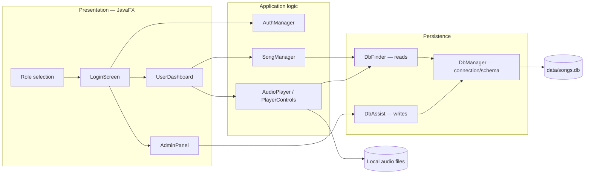
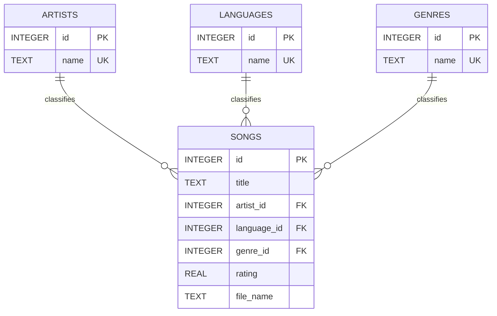

# MAD Music Player

[](https://openjdk.org/projects/jdk/17/)
[](https://openjfx.io/)
[](https://www.sqlite.org/)
[](LICENSE)

A desktop music-library application built with JavaFX, SQLite, JDBC, and Gradle. The project demonstrates separation between presentation, application logic, and persistence while supporting role-based library management, metadata discovery, and local audio playback.

> **Project status:** educational prototype. The repository contains a populated metadata catalog, but it intentionally does not distribute copyrighted audio files. Add audio you are permitted to use before testing playback.

## Functional scope

| Capability | User | Administrator | Implementation |
|---|:---:|:---:|---|
| Role-based sign-in | Yes | Yes | `LoginScreen`, `AuthManager` |
| Search by partial song title | Yes | — | `DbFinder.searchSongsByTitleLike` |
| Browse by artist, language, or genre | Yes | — | `SongManager`, `DbFinder` |
| Randomized quick play | Yes | — | `UserDashboard`, `PlayerControls` |
| Play/pause, seek, volume, next, previous | Yes | — | JavaFX `MediaPlayer` |
| Add a single catalog entry | — | Yes | `AdminPanel`, `DbAssist` |
| Import catalog entries from CSV/TXT | — | Yes | `DbAssist.importFromCSV` |
| Edit or delete catalog entries | — | Yes | `AdminPanel`, `DbAssist` |
| Create the database schema on startup | System | System | `DbManager.createSchemaIfNeeded` |

## Architecture



The layers are separated by responsibility rather than enforced as independent modules. In particular, playback retrieves metadata directly through `DbFinder` before opening the local file with JavaFX Media.

## Data model



The committed `data/songs.db` snapshot was checked on 14 July 2026:

| Relation | Rows | Purpose |
|---|---:|---|
| `songs` | 201 | Title, rating, local audio path, and classification keys |
| `artists` | 123 | Normalized artist names |
| `languages` | 6 | Normalized language labels |
| `genres` | 5 | Normalized genre labels |

The catalog's ratings range from 3.5 to 5.0. `PRAGMA integrity_check` returns `ok`, and no foreign-key violations were reported for the committed snapshot. These counts describe the included demonstration database; they are not performance benchmarks.

## Requirements

- JDK 17
- Git
- An internet connection on the first Gradle run so dependencies can be resolved
- MP3 or other JavaFX-compatible local media that you have permission to use
- Optional: the SQLite command-line client for the inspection commands below

A separate Gradle or JavaFX SDK installation is not required. The Gradle wrapper and OpenJFX Gradle plugin resolve the required platform-specific components.

## Build and run

```bash
git clone https://github.com/goutham-1902/Music-Player-Using-SQLite-and-Java.git
cd Music-Player-Using-SQLite-and-Java
./gradlew clean build
./gradlew run
```

On Windows, use `gradlew.bat clean build` and `gradlew.bat run`.

The application must be started with the repository root as its working directory because the database URL and default media paths are relative to that directory.

### Demonstration access

| Role | Password | Available workflow |
|---|---|---|
| User | `user123` | Search, explore, quick play, and playback |
| Administrator | `admin123` | Add, import, edit, and delete metadata |

These credentials are hard-coded in `AuthManager` and are suitable only for a local demonstration. They do not provide production-grade authentication or authorization.

## Add audio for playback

The database stores paths, not audio blobs. In the committed snapshot, 183 of 201 catalog entries follow this convention:

```text
data/audiofiles/<Song Title>.mp3
```

Create `data/audiofiles/` and place legally obtained audio at the path recorded in each song's `file_name` field. Audio is ignored by Git so it cannot be committed accidentally. The administrator's single-song workflow also derives the path from the title rather than copying a selected file.

To inspect the paths currently expected by the catalog:

```bash
sqlite3 data/songs.db "SELECT id, title, file_name FROM songs ORDER BY id;"
```

## Bulk-import format

The administrator import accepts plain comma-separated `.csv` or `.txt` rows with exactly six fields:

```text
title,artist,language,genre,rating,reserved
```

The current parser uses the first five values, derives the media path as `data/audiofiles/<title>.mp3`, and ignores the sixth value. It uses a simple comma split, so quoted commas and multiline fields are not supported. A standards-compliant CSV parser is recommended before using untrusted or complex input.

## Repository structure

```text
.
├── build.gradle                 # Dependencies, JavaFX modules, application entry point
├── data/
│   └── songs.db                 # Demonstration SQLite catalog
├── gradle/wrapper/              # Reproducible Gradle wrapper
└── src/main/java/
    ├── backend/                 # Authentication, discovery coordination, playback
    ├── database/                # Schema, queries, and catalog mutations
    └── gui/                     # JavaFX screens and player controls
```

Generated builds, compiled classes, local audio, IDE settings, and the redundant standalone SQLite JDBC JAR are excluded from version control. Gradle resolves `org.xerial:sqlite-jdbc:3.49.1.0` from Maven Central.

## Verification

```bash
./gradlew clean build
sqlite3 data/songs.db "PRAGMA integrity_check;"
sqlite3 data/songs.db "PRAGMA foreign_key_check;"
```

The Gradle build compiles and packages the application. The repository does not yet contain automated unit or UI tests, so playback and screen navigation still require manual verification on a graphical desktop.

## Known limitations and next steps

- Replace hard-coded shared passwords with salted password hashes and persistent user accounts.
- Enable and verify SQLite foreign-key enforcement on every connection.
- Use an established CSV library with validation, duplicate handling, and useful row-level error reporting.
- Let administrators select or copy an audio file instead of deriving its path from the title.
- Add unit tests for query and catalog operations and JavaFX integration tests for major workflows.
- Store configuration and user data outside the source tree for packaged desktop releases.
- Add persistent playlists, streaming support, and accessibility-focused UI styling.

## License

Released under the [MIT License](LICENSE). Audio files and third-party catalog content are not granted under this repository's software license; users are responsible for ensuring they have the necessary rights.

## Author

Goutham SDS Kodali — [connect on LinkedIn](https://www.linkedin.com/in/sds-kodali/).
